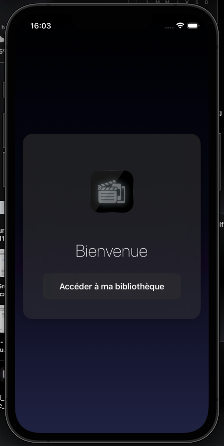
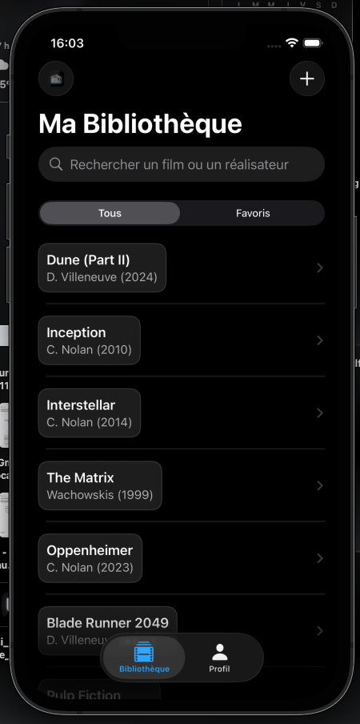
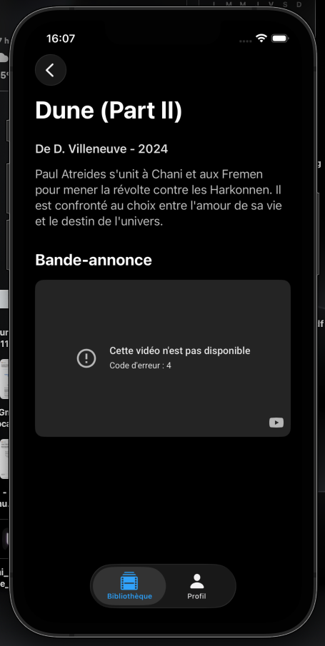
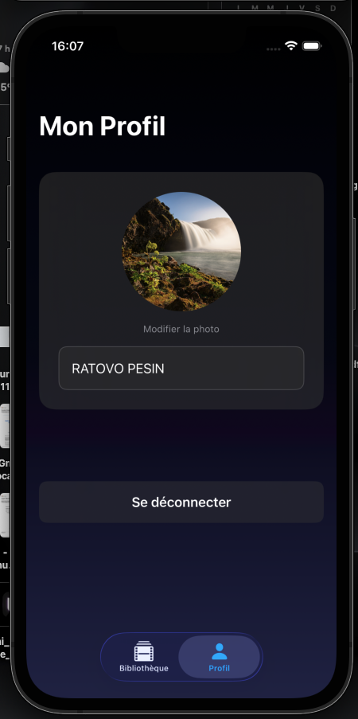

  

# LibFilms App (Projet iOS)

  
  
  

**LibFilms App** est une application iOS moderne de gestion de bibliothèque de films. Ce projet a été développé en réponse à des consignes académiques précises, mettant l'accent sur une **architecture modulaire**, le respect strict du pattern **MVVM**, et l'utilisation d'un **package `DesignSystem`** séparé.

L'application est conçue avec un thème sombre et épuré, inspiré d'Apple TV, utilisant des composants "en verre" (Glassmorphism) pour une interface utilisateur moderne.

---

## 📱 Aperçus des Écrans

| Login | Bibliothèque | Détail du Film | Profil |
| :---: | :---: | :---: | :---: |
|  |  |  |  |

---

## ✨ Fonctionnalités Principales

* **Authentification** : Écran de connexion simple et centré sur le logo.
* **Navigation** : Utilisation d'une `TabView` pour la navigation principale (Bibliothèque, Profil) et d'un `NavigationStack` pour la navigation "push" (Liste -> Détail).
* **Gestion de Bibliothèque** :
    * Affichage d'une liste de films (données mockées).
    * **Ajout** de nouveaux films via un formulaire modal (`.sheet`).
    * **Suppression** de films via un balayage (swipe) vers la gauche (`.onDelete`).
* **Filtrage & Recherche** :
    * Barre de recherche dynamique (`.searchable`) sur le titre et le réalisateur.
    * Filtre (`Picker`) pour segmenter la vue entre "Tous" et "**Favoris**".
* **Favoris** :
    * Ajout/Retrait d'un film des favoris via un balayage (swipe) vers la droite (`.swipeActions`).
* **Page Détail** :
    * Affichage des informations (Réalisateur, Année) et de la description complète.
    * Intégration d'un lecteur vidéo (`WKWebView`) pour afficher les bandes-annonces YouTube.
* **Gestion de Profil** :
    * **Photo de profil** : Sélection via `PhotosPicker` et persistance des données (`UserDefaults`).
    * **Nom d'utilisateur** : Modification via un champ `GlassTextField` et persistance des données (`@AppStorage`).
    * **Déconnexion** : Bouton avec alerte de confirmation (`.alert`) pour retourner à l'écran de Login.

---

## 🛠️ Architecture et Stack Technique

Ce projet a été conçu pour respecter rigoureusement les objectifs pédagogiques des consignes.

### 1. Architecture MVVM
L'application suit un pattern MVVM strict pour une séparation claire des responsabilités :
* **Model** (`MovieModel.swift`) : Représente la structure des données (conforme à `Identifiable` et `Hashable`).
* **View** (ex: `MovieListView.swift`) : Vues SwiftUI pures. Elles ne contiennent aucune logique métier et sont pilotées par le ViewModel.
* **ViewModel** (ex: `MovieListViewModel.swift`) : Conforme à `@Observable`. Il gère toute la logique métier (filtrage, recherche, favoris, suppression) et expose les données à la Vue via des propriétés `@Published` implicites.

### 2. Modularisation (Package `DesignSystem`)
Conformément aux consignes, un **Package Swift** local nommé `DesignSystem` a été créé et intégré. Il contient tous les composants UI réutilisables et leurs ViewModels associés, assurant une cohérence visuelle :
* `MovieCardView` / `MovieCardViewModel` (Cellule de film)
* `PrimaryButtonView` / `PrimaryButtonViewModel` (Bouton principal)
* `GlassTextField` (Champ de texte "en verre")

### 3. Gestion des Données (Mock Service)
* **Protocole** : Une `MovieServiceProtocol` a été définie pour abstraire la couche de données (une exigence clé).
* **Mock Service** : `MockMovieService` est une implémentation simulée de ce protocole, utilisant `async/await` pour simuler des appels réseau.
* **Injection de Dépendances** : Le service est **injecté** dans le `MovieListViewModel` via son initialisateur (`init(movieService: ...)`), respectant ainsi un point bonus des consignes.

### 4. Outils Swift Modernes
* **Concurrency** : Utilisation de `async/await` pour toutes les opérations asynchrones (ex: `loadMovies`, `addNewMovie`).
* **Navigation** : `NavigationStack` et `NavigationLink(value:)` pour une navigation moderne.
* **Persistance** : `UserDefaults` et `@AppStorage` pour sauvegarder l'image de profil et le nom d'utilisateur.
* **UI Moderne** : `PhotosPicker` pour la sélection d'images et `WKWebView` (via `UIViewRepresentable`) pour l'intégration vidéo.
